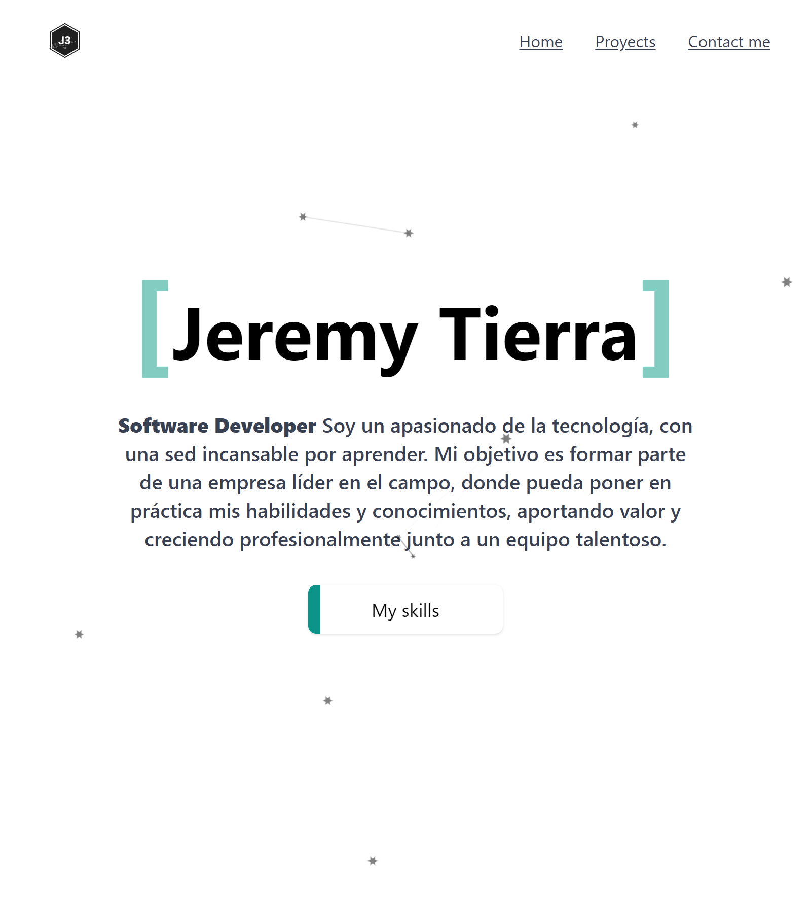

# Portafolio Web

Este es mi portafolio web personal desarrollado utilizando Vite, React y Tailwind CSS. Aquí presento mi información personal, proyectos, habilidades técnicas y formulario de contacto.

## Demo

Puedes ver una demostración en vivo de mi portafolio web [aquí](https://jeremytierra.vercel.app/).

## Características

- Sección de información personal y contacto.
- Lista de algunos proyectos con descripción y enlaces.
- Habilidades técnicas destacadas.
- Totalmente responsive y compatible con dispositivos móviles.

## Capturas de pantalla

## Tecnologías utilizadas

- Vite
- React
- Tailwind CSS

## Instalación

1. Clona este repositorio: `https://github.com/JeremyTierra/Portafolio.git`
2. Navega al directorio del proyecto: `cd Portafolio.git`
3. Instala las dependencias: `npm install`
4. Inicia el servidor de desarrollo: `npm run dev`
5. Abre tu navegador y ve a `http://localhost:3000`
